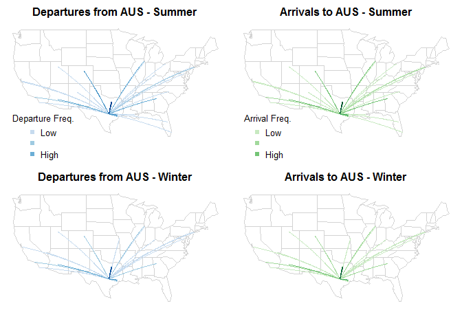
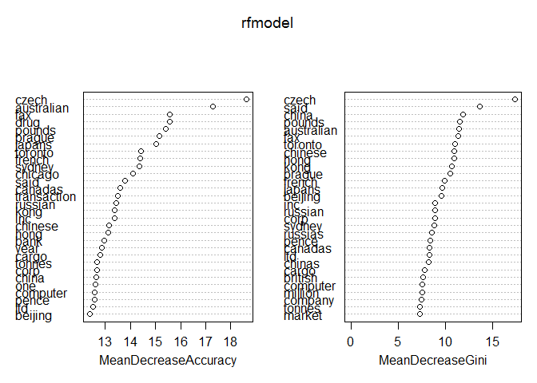

### Flights at ABIA

**Approach for Visualization**

With the flights data, I wanted to create something using the maps
package as I haven't had previous experience with designing graphics on
top of maps. The data also lends itself well to a network map--where
connections between AUS and other airports could be clearly visible. I
decided that a good question to answer with such a map is how arrivals
and departures vary between winter (defined as Dec. - Feb.) and summer
months (defined as Jun. - Aug.).

To start, I found a dataset (also on GitHub) with the latitudes and
longitudes for all airport codes and extracted the information I
required. I then created subsets of the Austin flights data for the
summer and winter months.

Once I had these subsets, I aggregated all origin/destination code pairs
to get the counts for each during each time period. I then split this
aggregated data into depature (where the origin is AUS) and arrival
subsets.

With the data prepared, I plotted the maps using the maps package and
used the geosphere package to iterate over each subset and plot
connections between AUS and the other airports. The geosphere package
uses sphereical trigonometry and the connections are plotted using great
circles (so realistically given the Earth's geometry).

**Analysis of Visualization**

The visualization shows there are clear differences in departures and
arrivals between the summer and winter months. In the winter, a much
larger proportion of flights are between AUS and other Texas airports.
This makese inuitive sense--people do less vacationing and traveling in
the winter, so most of the flights are short distance and remain within
the state. The flights to Florida are a great example of this effect. In
the winter, there are no flights to Florida.

However, the relative number of departures versus arrivals from each
airport seems to be fairly similar within each season.

One important note is that we can't compare magnitude across the maps
because the coloring is done on a relative basis within each map. In
other words, the darkest blue in the top left map represents the most
frequent connections within that specific map and the absolute number of
flights between dark blue connections in the summer v. the winter may be
different. I could have colored the lines based on the frequency
relative to the total number of arrivals and departures throughout the
year but that would have resulted in less interpretability within each
map.

### Author Attribution

To start, I extracted the directory names for all folders in C50train
and then used this list to read in all text files for all authors into
one list. I used this to create my training corpus and to begin the
process of working with the text data. I applied the following tm\_map
functions: tolower, removeNumbers, removePunctuation, stripWhitespace. I
also removed english stop words as well as "next", "else", and
"break"--these words caused issues with my models as they are reserved
words in R.

After preparing my corpus, I created a DTM of the terms appearing in at
least 2% of the documents. This left me with 1,895 terms which should be
sufficient for running a model with 50 classifiers. The 2% cutoff should
capture words that are relatively unique to a smaller subset of authors
(as each author accounts for 2% of the training data). I tried other
cut-offs for word frequency and found little improvement in the models.
I converted this DTM to a dataframe and added the author names as a
column so that I could use this dataframe with prediction packages in R.

The first model I ran was a random forest model. I used the default
values for mtry, or the number of variables used in each tree, (sqrt of
N) and number of trees (500). Different values for mtry seemed to have
little effect on the model and, with so many classifiers and terms,
increasing the ntrees above 500 for at best a marginal improvement did
not seem sensical from a computational perspective.

The variable importance discovered in the model is given by the plot
below. We can see that the model finds terms related to certain
countries/regions as very important. This makes sense--certain authors
will cover certain regions so those terms would be effective for
differentiating between the classes.

The second model I decided to use was a linear discriminant analysis,
with its output summarized below:

    ##         Length Class  Mode     
    ## prior      50  -none- numeric  
    ## counts     50  -none- numeric  
    ## means   94650  -none- numeric  
    ## scaling 92757  -none- numeric  
    ## lev        50  -none- character
    ## svd        49  -none- numeric  
    ## N           1  -none- numeric  
    ## call        3  -none- call     
    ## terms       3  terms  call     
    ## xlevels     0  -none- list

To test the predictive power of these models, I read all of the test
files into one corpus and applied the same tm\_map transformers that I
applied to the training corpus.

After creating a testing corpus, I created a testing DTM that matched
the terms in the training DTM. If any words were in the training set and
not in the testing set, I added columns for those words and set all
values equal to zero (as there were no occurances in the test files). If
any words were in the testing set but not the training set, they were
excluded.

I removed new terms rather than incorporating them into my models
because of the types of models I was using. Particularly, for random
forests, there would be nothing for the model split on with new
terms--so it only made sense to exlude them and conform the dimensions
of my testing DTM to my training DTM.

Once I had a testing dataframe that matched the dimensions of my
training dataframe, I ran predictions for both the random forest and LDA
models. After making predictions, I used the caret and e1071 packages to
create confusion matrices. These matrices give the overall statistics
and accuracy below:

**Random Forest Accuracy Result:**

    ## Accuracy 
    ##   0.6448

First 5 authors in confusion matrix:

    ##                  Reference
    ## Prediction        AaronPressman AlanCrosby AlexanderSmith BenjaminKangLim
    ##   AaronPressman              47          0              1               0
    ##   AlanCrosby                  0         37              0               0
    ##   AlexanderSmith              0          0             12               0
    ##   BenjaminKangLim             0          0              0              22
    ##   BernardHickey               0          0              0               0
    ##                  Reference
    ## Prediction        BernardHickey
    ##   AaronPressman               0
    ##   AlanCrosby                  0
    ##   AlexanderSmith              0
    ##   BenjaminKangLim             0
    ##   BernardHickey              27

**LDA Accuracy Result:**

    ## Accuracy 
    ##    0.456

First 5 authors in confusion matrix:

    ##                  Reference
    ## Prediction        AaronPressman AlanCrosby AlexanderSmith BenjaminKangLim
    ##   AaronPressman              29          1              1               0
    ##   AlanCrosby                  0         24              0               0
    ##   AlexanderSmith              0          0              7               0
    ##   BenjaminKangLim             0          0              1               8
    ##   BernardHickey               0          0              1               0
    ##                  Reference
    ## Prediction        BernardHickey
    ##   AaronPressman               0
    ##   AlanCrosby                  0
    ##   AlexanderSmith              1
    ##   BenjaminKangLim             0
    ##   BernardHickey              17

The LDA model's underperformance may be due to several assumptions it
makes--that the predictor distributions are gaussian with the same
covariance structure. This may not be a great assumption considering
that articles are written by people with bias towards certain language
or wording.

While, at first glance, the accuracy scores don't appear to be
great--it's important to note the difficulty of classifying text between
50 different authors from the same source. Many of the articles and
authors are going to be similar and it will be hard to reliably classify
articles in all cases. I think that, given this consideration, the
accuracy scores are actually pretty reasonable.

It's easy to see why the models have difficulty discerning the correct
author for certain articles when you look at pairs that were often
confused. Looking at the confusion matrices, I found two sets of authors
were frequently mistaken for each other under both models. Detail on
these pairs is given below:

**John Mastrini & Jan Lopatka**

Number of times John Mastrini was incorrectly classified as Jan Lopatka:
LDA:

    ## JanLopatka 
    ##         11

RF:

    ## JanLopatka 
    ##         12

Number of times Jan Lopatka was incorrectly classified as John Mastrini:
LDA:

    ## JohnMastrini 
    ##           23

RF:

    ## JohnMastrini 
    ##           16

John Mastrini - 15 most freq. words (in testing DTM):

    ##       said      czech    percent government     prague       bank 
    ##        333        222        141         89         85         84 
    ##    billion       last     crowns      banks      crown    central 
    ##         70         65         64         61         59         56 
    ##      first     growth       year 
    ##         55         53         50

Jan Lopatka - 15 most freq. words (in testing DTM):

    ##       said      czech    percent    billion government       year 
    ##        314        242        107        101         86         82 
    ##       will     prague     crowns      klaus       last   ministry 
    ##         74         72         71         65         65         56 
    ##       also   minister        gas 
    ##         52         52         51

With the top 15 words, there is some clear overlap that could explain
the confusion between these two authors. Both frequently mention similar
terms that seem to be related to the czech government and finance and
the top three terms are the same for both.

**Darren Schuettler & Heather Scoffield**

Number of times Darren Scheuttler was incorrectly classified as Heather
Scoffield: LDA:

    ## HeatherScoffield 
    ##               16

RF:

    ## HeatherScoffield 
    ##               36

Number of times Heather Scoffield was incorrectly classified as Darren
Scheuttler: LDA:

    ## DarrenSchuettler 
    ##                9

RF:

    ## DarrenSchuettler 
    ##               25

Darren Schuettler - 15 most freq. words (in testing DTM):

    ##     said     gold    stock   mining   report  toronto  million canadian 
    ##      455      270      161      130      118      109      103       88 
    ##  percent      ltd   shares     will  company  billion  canadas 
    ##       88       86       82       82       79       75       75

Heather Scoffield - 15 most freq. words (in testing DTM):

    ##       said     canada      trade       will government       gold 
    ##        396        116        107        102         88         87 
    ##   canadian       year    percent    million        new        one 
    ##         85         73         68         67         58         57 
    ##    company  financial    canadas 
    ##         56         56         55

Again, it's easy to see what terms are driving the errors in the models.
Both authors here speak frequently about terms related to canada,
government, and financial exchanges. The random forest model did perform
markedly worse for these authors than the LDA model, which is especially
interesting given the relative performance on the entire test set. It's
difficult to say exactly what is causing this--perhaps certain nodes
related to the canadian government or financial sector in the random
forest resulted in an unusual frequency of misclassification for this
set of authors.

### Practice with Association Rule Mining

To read in the txt file, I used the read.transactions() function from
the arules package. This allowed me to read the file in directly into
the basket format for transactions and immediately run apriori() to
develop some rules. I tried several support and confidence levels and
found a support of .001 and confidence of .75 to give a reasonable
number of rules (62 in total) to examine while maintaining pretty strong
associations. This implies that, for the rules discovered, the item sets
must appear in at least 0.1% of the baskets (or ~10 of 9,835) and must
have 75% probability of occurance. I also limited the length to 3 to
keep to rules straightforward--I changed this to 4 and got 454
additional rules, so I thought it was better to limit the rule set to
simple associations for the purposes of this excercise.

Apriori() function output:

    ## 
    ## Parameter specification:
    ##  confidence minval smax arem  aval originalSupport support minlen maxlen
    ##        0.75    0.1    1 none FALSE            TRUE   0.001      1      3
    ##  target   ext
    ##   rules FALSE
    ## 
    ## Algorithmic control:
    ##  filter tree heap memopt load sort verbose
    ##     0.1 TRUE TRUE  FALSE TRUE    2    TRUE
    ## 
    ## apriori - find association rules with the apriori algorithm
    ## version 4.21 (2004.05.09)        (c) 1996-2004   Christian Borgelt
    ## set item appearances ...[0 item(s)] done [0.00s].
    ## set transactions ...[169 item(s), 9835 transaction(s)] done [0.00s].
    ## sorting and recoding items ... [157 item(s)] done [0.00s].
    ## creating transaction tree ... done [0.00s].
    ## checking subsets of size 1 2 3 done [0.00s].
    ## writing ... [62 rule(s)] done [0.00s].
    ## creating S4 object  ... done [0.00s].

To extract the strongest associations from the 62 rules, I ordered the
rules by confidence and pulled the top 10, which can be seen below:

    ##    lhs                         rhs                    support confidence      lift
    ## 1  {rice,                                                                         
    ##     sugar}                  => {whole milk}       0.001220132  1.0000000  3.913649
    ## 2  {canned fish,                                                                  
    ##     hygiene articles}       => {whole milk}       0.001118454  1.0000000  3.913649
    ## 3  {house keeping products,                                                       
    ##     whipped/sour cream}     => {whole milk}       0.001220132  0.9230769  3.612599
    ## 4  {bottled water,                                                                
    ##     rice}                   => {whole milk}       0.001220132  0.9230769  3.612599
    ## 5  {bottled beer,                                                                 
    ##     soups}                  => {whole milk}       0.001118454  0.9166667  3.587512
    ## 6  {grapes,                                                                       
    ##     onions}                 => {other vegetables} 0.001118454  0.9166667  4.737476
    ## 7  {hard cheese,                                                                  
    ##     oil}                    => {other vegetables} 0.001118454  0.9166667  4.737476
    ## 8  {cereals,                                                                      
    ##     curd}                   => {whole milk}       0.001016777  0.9090909  3.557863
    ## 9  {pastry,                                                                       
    ##     sweet spreads}          => {whole milk}       0.001016777  0.9090909  3.557863
    ## 10 {liquor,                                                                       
    ##     red/blush wine}         => {bottled beer}     0.001931876  0.9047619 11.235269

All of these rules have high confidence, but rule 10 has exceptionally
high lift. This means that the confidence for the association greatly
exceeds the expected confidence. The rule makes sense--it is not
suprising that people who buy alcohol may buy several kinds together. A
more interesting rule is rule 2. Why whole milk is frequently purchasee
with canned fish and hygiene articles is not immediately clear to me,
but the confidence and lift are both fairly high. In general, there were
a lot of strong associations with whole milk. This could simply be
because milk is a staple grocery item that people buy regardless of what
else they have on the shopping list.
