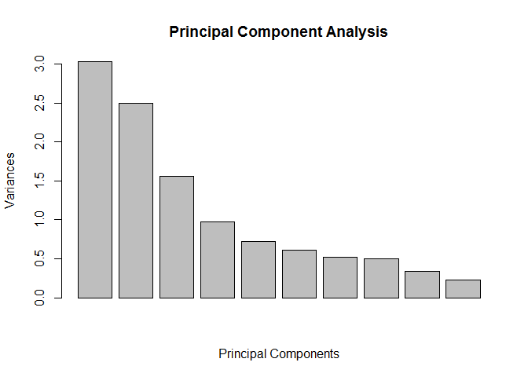
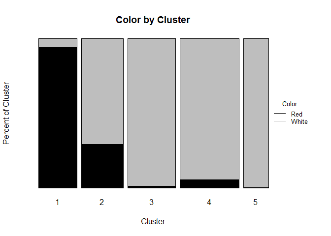

Exploratory Analysis - Voting Data
----------------------------------

**Do certain kinds of voting equipment lead to higher rates of
undercount?**

Summarizing the data into the table below allows for easy comparison
between the relative rates of undercount for each of the equipment
types. It's clear that punch cards stand out as having a higher rate of
undercount relative to the other methods while optical equipment
resulted in the lowest rate of undercount. The absolute number for
undercount is also an important consideration. Optical and punch card
equipment is used with a much larger percentage of the total population,
so a higher relative undercount with these methods will result in a
larger effect on the absolute number of votes counted.

    ##     equip ballots   votes undercount percentundercount
    ## 1   LEVER  427780  410764      17016        0.04142525
    ## 2 OPTICAL 1436159 1397069      39090        0.02798001
    ## 3   PAPER    3454    3341        113        0.03382221
    ## 4   PUNCH  823921  785459      38462        0.04896755

**Does a higher rate of undercounting for certain types of equipment
(i.e. lever and punch card) result in a disparate impact on poor and
minority communities?**

The plots below provide insight on whether the difference between the
rate of undercount disparately affects minority or poor populations.

Counties that use paper voting, one of the equipment types with a lower
rate of undercount, have the highest average African American
popluation. However, it is important to note that only 3,454 ballots
were made via paper, a number that is fairly insignificant in relation
to the 2,691,314 ballots submitted.

With this consideration, to analyze whether there was a disparate impact
on minorities, the next question is how the popluations of lever and
punch card voting compare to optical (as shown in the summary table I
created above, lever and punch card equipment had a much higher rate of
undercount than optical equipment). In the box plot, it's clear that the
counties that use either lever or punch card equipment typically have
significantly higher African American populations than counties that use
optical equipment. As a result, it can be concluded that there was a
disparate effect on African American populations.

Looking at relative poverty between counties using different equipment
types reveals a similar conclusion:

The poorer populations were clearly more adversely affected by
undercounting. Optical has by far the fewest counties meeting the povery
cut-off defined in the dataset (where \>25% of the population must live
below 1.5 \* the Federal poverty line) and it had the lowest rate of
undercount. Counties that used paper, lever, or punch card equipment
were more likely to be considered poor and faced higher rates of
undercount.

Bootstrapping - ETF Data
========================

For this analysis, I pulled price data and calculated daily returns for
the period 8/1/2010 to 7/31/2015.

    ## Warning: package 'fImport' was built under R version 3.2.1

    ## Loading required package: timeDate

    ## Warning: package 'timeDate' was built under R version 3.2.1

    ## Loading required package: timeSeries

    ## Warning: package 'timeSeries' was built under R version 3.2.1

    ## Warning: package 'foreach' was built under R version 3.2.1

    ## Warning: package 'mosaic' was built under R version 3.2.1

    ## Loading required package: car
    ## Loading required package: dplyr

    ## Warning: package 'dplyr' was built under R version 3.2.1

    ## 
    ## Attaching package: 'dplyr'
    ## 
    ## The following objects are masked from 'package:timeSeries':
    ## 
    ##     filter, lag
    ## 
    ## The following objects are masked from 'package:plyr':
    ## 
    ##     arrange, count, desc, failwith, id, mutate, rename, summarise,
    ##     summarize
    ## 
    ## The following objects are masked from 'package:stats':
    ## 
    ##     filter, lag
    ## 
    ## The following objects are masked from 'package:base':
    ## 
    ##     intersect, setdiff, setequal, union
    ## 
    ## Loading required package: lattice
    ## Loading required package: ggplot2

    ## Warning: package 'ggplot2' was built under R version 3.2.1

    ## Loading required package: mosaicData

    ## Warning: package 'mosaicData' was built under R version 3.2.1

    ## 
    ## Attaching package: 'mosaic'
    ## 
    ## The following objects are masked from 'package:dplyr':
    ## 
    ##     count, do, tally
    ## 
    ## The following object is masked from 'package:car':
    ## 
    ##     logit
    ## 
    ## The following objects are masked from 'package:timeSeries':
    ## 
    ##     quantile, sample
    ## 
    ## The following object is masked from 'package:timeDate':
    ## 
    ##     sample
    ## 
    ## The following object is masked from 'package:plyr':
    ## 
    ##     count
    ## 
    ## The following objects are masked from 'package:stats':
    ## 
    ##     binom.test, cor, cov, D, fivenum, IQR, median, prop.test,
    ##     quantile, sd, t.test, var
    ## 
    ## The following objects are masked from 'package:base':
    ## 
    ##     max, mean, min, prod, range, sample, sum

To analyze the relative returns and risk for each of the ETFs over the
time period, I calculated the standard deviation, mean, and range of
returns below:

**Standard Deviation:**

    ##  LQD.PctRet  SPY.PctRet  TLT.PctRet  VNQ.PctRet  EEM.PctRet 
    ## 0.003581299 0.009351005 0.009768007 0.011520712 0.013727342

**Mean:**

    ##   EEM.PctRet   LQD.PctRet   TLT.PctRet   VNQ.PctRet   SPY.PctRet 
    ## 6.504442e-05 2.036266e-04 3.403541e-04 5.390817e-04 6.209970e-04

**Range:**

    ##       SPY.PctRet  TLT.PctRet  LQD.PctRet  EEM.PctRet  VNQ.PctRet
    ## [1,] -0.06512324 -0.05044946 -0.02052322 -0.08337254 -0.08686714
    ## [2,]  0.04649921  0.03965546  0.01466774  0.06240039  0.09103929

The standard deviations and means have been sorted from lowest to
highest in the tables above (leftmost is least volatile/least reward).

In most cases, the asset classes with higher volatility seem to provide
higher average daily returns. This intuitively makes sense--as investors
take on more risk, they expect a higher return. Exceptions to this are
SPY, which ranked higher for returns than its volatility rank, and EEM,
which ranked lowest for returns and which was the most volatile. While
the risk/reward trade-off between standard deviation and returns is an
easy way of looking at assets, there is clearly more to consider.

In particular, some of these ETFs may have return distributions with
"fatter" tails and they may experience more extreme events than expected
by a standard gaussian distribution. It's easy to see hints of this when
looking at TLT versus SPY. While TLT has a higher standard deviation
than SPY, SPY has a much wider range and the asset class may experience
extreme events more frequently.

A simple way of viewing this graphically through a boxplot. Here, we can
see that there are many outliers. Specifically, SPY appears to
experience far more extreme events than TLT, even though the latter has
higher volatility. Between all asset classes, LQD seems to have the
tighest grouping of returns.

Another view of the distributions can be seen through the histograms
below:

While it's clear there is a well defined mean in the returns it's also
clear that the distributions we are dealing with are not completely
normal. The frequency of outliers in the histograms again indicate the
presence of "fat tails", or positive kurtosis.

With the volatilities, tail considerations, and distributions of
negative returns above, it seems safe to classify LQD as the safest
asset class by far. On the opposite end of the spectrum, EEM and VNQ are
by far the most risky given the very high standard deviations and large
number of outliers on the downside--hinting that the distributions may
have tails that are particularly fat. Between SPY and TLT, even though
SPY has a slightly higher standard deviation, TLT seems to be less risky
as its distribution appears to be tighter and it has experienced fewer
outliers on the negative end of the spectrum.

Before construting a safe and risky portfolio, one final consideration
is the correlation between asset classes.

**Correlation Matrix:**

    ##            SPY.PctRet TLT.PctRet   LQD.PctRet   EEM.PctRet VNQ.PctRet
    ## SPY.PctRet  1.0000000 -0.5408545 -0.119725402  0.838535350  0.7737398
    ## TLT.PctRet -0.5408545  1.0000000  0.731875309 -0.429065734 -0.2795580
    ## LQD.PctRet -0.1197254  0.7318753  1.000000000 -0.005981991  0.1143885
    ## EEM.PctRet  0.8385353 -0.4290657 -0.005981991  1.000000000  0.6908919
    ## VNQ.PctRet  0.7737398 -0.2795580  0.114388520  0.690891863  1.0000000

The matrix shows that equities tend to move with equities and bonds tend
to move with bonds. For example, SPY and EEM, two equity ETFs, have a
fairly high positive correlation to one another while these ETFs are
both negatively correlated to TLT and LQD, the two bond products. When
creating a portfolio, this is a key consideration because a negative
correlation implies that ETFs are less likely to fall in value together.
This is the basic idea behind holding a diversified portfolio.

With that in mind, I have defined my portfolios and run VaR analysis for
a 20 day holding period as follows:

Simulation 1 - "Base": 20% in each asset class

Simulation 2 - "Safe": 30% SPY, 30% TLT, 40% LQD *(lowest standard
deviations, relatively few outliers, SPY and TLT/LQD are negatively
correlated)*

Simulation 3 - "Risky": 50% EEM, 50% VNQ *(high standard deviations,
many outliers, and highly correlated)*

**5% Value at Risk by portfolio (20 day):**

    ##      safevar  basevar  riskyvar
    ## 5% -1232.352 -3110.27 -7254.476

These value at risk numbers show the dollar amount an investor could
expect to lose with 5% probability over a four week period in each
portfolio. Clearly--investors in the risky portfolio must be willing to
accept larger downside risk.

That said, investors would not be willing to take such risks without the
possibility for greater reward.

To illustrate this, I have calculated the 75th and 95th percentile
returns for each of the portfolio distributions:

**75th Percentile Total Portfolio Value (20 day):**

    ##         Base     Safe  Risky
    ## 75% 103177.4 102050.1 106038

**95th Percentile Total Portfolio Value (20 day):**

    ##         Base     Safe    Risky
    ## 95% 105164.1 103294.9 109177.9

Clearly, with riskier portfolios there is also the possibility for a
higher payout on the upside. In choosing between these three portfolios,
investors should consider their goals and whether they can take on
additional downside risk for a potentially larger payout.

Clustering and PCA
==================

**Clustering**

For clustering the wine data, k-means makes more sense than hierarchical
because the data set is fairly large and it may not make sense to group
chemical components in a hierarchical tree. While it's certainly
possible to create such a tree, splitting on chemical properties doesn't
seem to make as much intuitive sense as grouping based on chemical
similarity. Wines are often grouped into many categories based on
resembelance to each other--which seems more analogous to the k-means
process. I also tried running hierarchical trees and that resulted in a
tree without a clear height to cut at.

I ran the k-means analysis with five clusters. The properties of these
clusters can be seen below:

    ##   fixed.acidity volatile.acidity citric.acid residual.sugar  chlorides
    ## 1      8.373595        0.5057624   0.2710051       2.465247 0.08238671
    ## 2      7.153984        0.3541758   0.3020234       3.338008 0.05604844
    ## 3      6.923469        0.2819898   0.3446122       7.717109 0.04971837
    ## 4      6.841653        0.2867026   0.3236816       5.232311 0.04562742
    ## 5      6.984424        0.2965052   0.3577094       9.670746 0.05230628
    ##   free.sulfur.dioxide total.sulfur.dioxide   density       pH sulphates
    ## 1            11.45954             29.27683 0.9963955 3.303543 0.6414055
    ## 2            22.37500             82.61953 0.9933786 3.221758 0.5299453
    ## 3            42.21769            159.90884 0.9951334 3.194265 0.4959524
    ## 4            29.80100            120.92123 0.9933970 3.198248 0.4952073
    ## 5            52.69568            206.87958 0.9965310 3.176950 0.5175785
    ##     alcohol
    ## 1 10.584001
    ## 2 10.940482
    ## 3 10.121800
    ## 4 10.782845
    ## 5  9.621182

**Principal Component Analysis**

Running principal component analysis on this same data gave the variance
plot below:

After centering and scaling the chemical properties, principal component
analysis explains a moderate amount of variance between the first few
components but much of the variance still remains. This is easy to see
in the sumary of the PCA below:

Summary of PCA:

    ## Importance of components:
    ##                           PC1    PC2    PC3     PC4     PC5     PC6
    ## Standard deviation     1.7407 1.5792 1.2475 0.98517 0.84845 0.77930
    ## Proportion of Variance 0.2754 0.2267 0.1415 0.08823 0.06544 0.05521
    ## Cumulative Proportion  0.2754 0.5021 0.6436 0.73187 0.79732 0.85253
    ##                            PC7     PC8     PC9   PC10    PC11
    ## Standard deviation     0.72330 0.70817 0.58054 0.4772 0.18119
    ## Proportion of Variance 0.04756 0.04559 0.03064 0.0207 0.00298
    ## Cumulative Proportion  0.90009 0.94568 0.97632 0.9970 1.00000

To explain 90% of the variance in the data set, a full 7 principal
components would need to be used.

Given that there are just 11 chemical dimensions, this indicates that
the data structure may not have a clear orientation and PCA is probably
not the best method to use here.

**Comparison of Methods**

With the above considerations, clustering seems to make more sense for
this data. While the orientation of the points could be clearer in PCA,
wines can usually be grouped into distinct categories (sweet white, dry
red, etc.) which share chemical properties and this fact seems to lends
itself well to clustering.

**Evaluation of Clustering**

The plot below shows how well clustering was able to differentiate
between two of the clearest categories for wine--white and red:

Clustering does seem to be fairly effective in splitting on wine color.
Cluster 1 is heavily weighted to red wine, while 3, 4, and 5, are almost
completely white. The only cluster with some ambiguity is cluster 2.
This cluster seems to represent wines that are similar in chemical
properties across color. Perhaps these are wines that lie somewhere in
between the typical red/white spectrum (maybe Rose?).

We can also evaluate how successful wine is in grouping quality wines
together:

Clearly, clustering is very bad at seperating good wines from bad. This
is not a surprise given what was shown by the color plot. Almost all red
wines are in one category so the clustering is clearly not
differentiating based on quality of those wines. Moreover, wine ratings
are inherently subjective so it's not necessarily surprising that the
model was not able to differentiate poor wines from quality wines (even
though good wines may share certain chemical proprties).

Market Segmentation
===================

When defining a market segment, I think of users that share similar
interests. With this in mind, I believe it makes sense to try and create
groupings of users based on categorical interests through clustering.
Doing so may allow us to isolate specific groups that share interests in
certain categories.

To begin, I ran a k-means cluster analysis (with 8 centers) on all
variables except uncategorized, chatter, spam, and adult. Given the fact
that spam and adult may be attributed to bots, I wanted to see how the
data would be categorized without that noise. Moreover, the
uncategorized and chatter categories are likely to have a significant
amount of noise as they are not as clearly defined.

**Cluster Sizes:**

    ## 
    ##    1    2    3    4    5    6    7    8 
    ## 4021  685  532  388  359  402  512  983

Through k-means, the data seems to be fairly well split across clusters.
The main exception is cluster 1, which is much larger. We can see the
different frequencies for each category between clusters by creating
barplots for the sums of the category frequencies across users in each
cluster:

As expected, cluster 1 appears to have faired relatively poorly in
grouping users based on the categories of their tweets. The category
with the highest frequency for this cluster is given as the below:

**Primary Category - Cluster 1:**

    ## photo_sharing 
    ##             3

It may be that this cluster represents users that share a significant
number of photos regardless of the users' other categorical interests.
Summing up the frequency of photo shares across clusters reveals that
cluster 1 is indeed the primary "photo sharing" cluster.

**Photo Sharing Freq. Across Clusters:**

    ##   cluster  sum
    ## 1       1 9598
    ## 2       2 1699
    ## 3       3 3282
    ## 4       4 1161
    ## 5       5  925
    ## 6       6 1104
    ## 7       7 1189
    ## 8       8 2298

There are several clusters within the analysis that seem to be more
defined by similar interests. Namely, clusters 4, 5, 6, and 8 appear to
have very strong interest in one category as well as a lesser secondary
interest. Clusters 3 and 7 also have seem focused on a primary category
but these clusters appear to have more than one main secondary category.
Based on this, I pulled a select number of top categories for these
clusters below.

**Top categories - Cluster 3 - "Young Women (?)":**

    ## [1] "cooking"       "photo_sharing" "fashion"

**Top categories - Cluster 4 - "Health Nuts":**

    ## [1] "health_nutrition" "personal_fitness"

**Top categories - Cluster 5 - "Potically Minded Professionals (?)":**

    ## [1] "politics" "travel"

**Top categories - Cluster 6 - "College Students":**

    ## [1] "college_uni"   "online_gaming"

**Top categories - Cluster 7 - "Informed Adults (?)":**

    ## [1] "news"       "politics"   "automotive"

**Top categories - Cluster 8 - "Health Nuts 2":**

    ## [1] "health_nutrition" "personal_fitness"

There is clear segmentation going on between various clusters. Cluster 4
and 8 share the same primary and secondary categories and, looking back
at the barplots, have very similar frequencies across all categories.
These "Health Nut" clusters could be grouped into one segment for
marketing and research purposes.

Moreover, the other clusters seem to be provide coherent groupings. At
this point, while it may not be clear exactly what segment of the
population these clusters represent (i.e. the "Young Women" cluster is
named such based on my subjective experiences in the real world but they
may not be in the actual cluster composition)--the analysis did succeed
in finding populations with similar interests and the groupings would be
very valuable for NutrientH20 in their marketing efforts.
